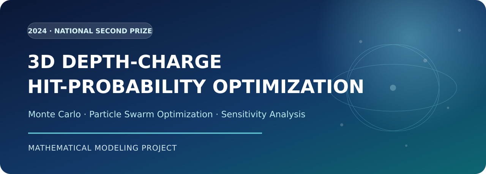
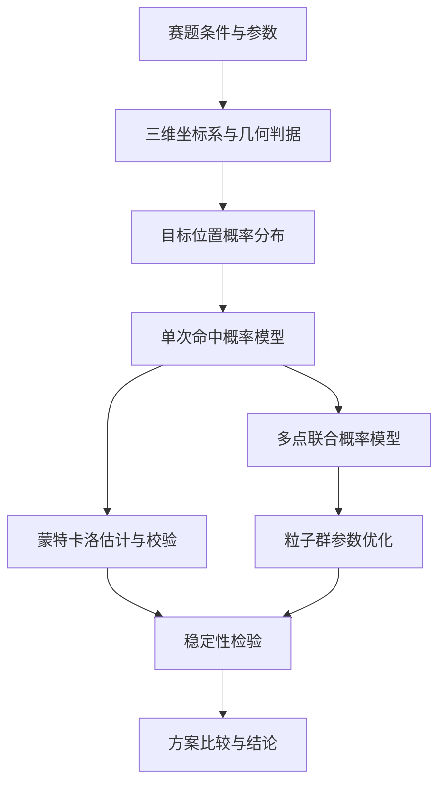

# 3D Depth-charge Hit-probability Optimization

> 基于三维概率密度空间的反潜航空深弹命中概率优化方案



[](#项目简介)
[](#项目简介)
[](#建模框架)
[](README.md)

> 2024 年数学建模竞赛全国二等奖论文归档与项目化展示。仓库保留原始论文，并以更适合 GitHub 阅读的方式重组研究问题、建模方法、求解流程和主要结论。

[获取原论文（PDF）](paper/README.md) · [查看优化版论文导读](docs/论文导读.md) · [English Summary](README_EN.md)

## 项目简介

本文围绕不确定定位条件下的概率优化问题展开研究。针对单点投放、三维定位误差以及多点阵列投放三类情形，分别建立概率模型，并结合蒙特卡洛模拟与粒子群优化算法求解。研究重点是描述目标位置的不确定性、构造命中事件的几何判据，并在给定约束下搜索更优的参数组合与投放策略。

本仓库用于展示数学建模的完整研究链路：

- 将实际背景抽象为三维概率空间中的随机事件；
- 用正态分布与单边截尾正态分布刻画定位误差；
- 通过蒙特卡洛模拟估计复杂命中事件的概率；
- 使用粒子群算法联合优化多项决策参数；
- 通过重复试验与参数敏感性分析检验模型稳定性。

> [!NOTE]
> 本项目是基于赛题条件完成的数学建模作品，仅用于学术交流与竞赛经验分享，不代表现实场景中的工程或军事应用结论。

## 问题概览

| 子问题 | 核心任务 | 建模重点 | 求解方法 |
| --- | --- | --- | --- |
| 问题一 | 分析平面位置和引爆深度与单次命中概率的关系 | 二维正态定位误差、三维几何命中区域、双引信条件 | 概率积分、蒙特卡洛模拟 |
| 问题二 | 在三个方向均存在定位误差时优化关键参数 | 水平正态分布、深度单边截尾正态分布 | 分层概率模型、参数遍历 |
| 问题三 | 优化多点阵列的布局、顺序与公共参数 | 多事件联合概率、未命中区域更新、策略比较 | 粒子群优化、敏感性分析 |

## 建模框架



### 1. 概率空间建模

以目标中心位置为参照建立三维坐标系，将水平定位误差建模为相互独立的正态随机变量，并用单边截尾正态分布描述带有物理边界约束的深度误差。命中事件由目标几何范围、有效作用范围与引信触发条件共同确定。

### 2. 蒙特卡洛概率估计

对目标位置进行重复随机采样，依据命中判据统计有效样本比例，从而估计难以直接积分求解的概率。通过扩大样本规模并比较多次模拟结果，检验估计值的收敛性与稳定性。

### 3. 多参数联合优化

在多点阵列情形下，以总命中概率为主要评价指标，将公共深度参数与平面间隔纳入统一搜索空间。粒子群算法负责搜索候选参数组合，多个投放次序则通过相同的评价框架进行横向比较。

## 主要结果

| 子问题 | 论文给出的主要结论 |
| --- | --- |
| 问题一 | 在给定参数下，蒙特卡洛结果随样本量增加逐渐稳定；论文报告的最大综合命中概率为 `0.082`。 |
| 问题二 | 引入三维定位误差后，通过参数遍历得到论文报告的最佳深度参数 `118 m`，对应最大命中概率 `0.0223`。 |
| 问题三 | 五类策略中，边缘优先策略的综合表现最好；论文报告的总命中概率为 `0.7634`。 |

以上数值均为原论文在赛题假设和给定参数下的模拟结果。详细参数、公式推导、图表和检验过程请以 [原论文](paper/README.md) 为准。

## 方法亮点

- **由几何关系到概率事件**：把三维空间中的命中条件转化为可计算的随机事件。
- **解析模型与随机模拟结合**：对可积分部分使用概率论推导，对复杂边界使用蒙特卡洛估计。
- **从单点扩展到多点联合决策**：在统一概率框架下比较不同阵列与执行顺序。
- **设置模型检验环节**：通过增加模拟次数、改变关键参数和重复试验观察结果波动。

## 仓库结构

```text
.
├── README.md              # 中文项目主页
├── README_EN.md           # English summary
├── NOTICE.md              # 使用与学术诚信说明
├── assets/
│   └── banner.svg         # 项目封面
├── docs/
│   └── 论文导读.md         # 优化后的论文内容导读
└── paper/
    ├── README.md          # 原论文获取与校验说明
    ├── restore_pdf.py     # PDF 无损还原脚本
    └── parts/             # 原始 PDF 的无损分片
```

## 阅读建议

1. 先阅读本页的“问题概览”和“建模框架”，快速理解研究主线；
2. 再查看 [优化版论文导读](docs/论文导读.md)，了解各问之间的递进关系；
3. 最后根据 [原论文获取说明](paper/README.md) 还原 PDF，核对完整公式、图表、参数与附录。

## 引用建议

如需在学习笔记、课程报告或非商业研究中引用本项目，可使用以下格式：

```text
xiaocongfree2003. 基于三维概率密度空间的命中概率优化方案：
2024 年数学建模竞赛全国二等奖论文 [EB/OL]. GitHub, 2024.
```

## 说明

原始论文保持不变；本仓库中的 README 与论文导读仅对内容结构、术语一致性和阅读体验进行了优化。若论文正文与仓库导读存在差异，以原始论文为准。
